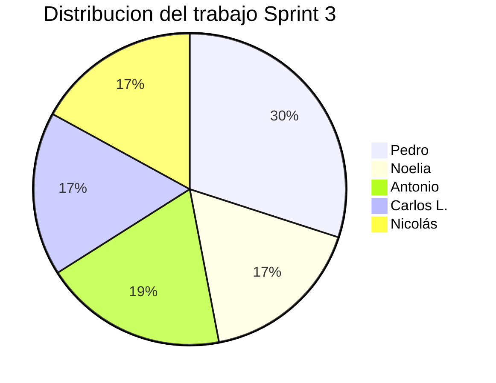

### Reporte de Avance: Sprint 3

**Proyecto:** Gestión de obras musicales para orquesta clásica  
**Metodología:** SCRUM

#### Objetivos del Sprint actual
- [x] Finalizar y unificar la documentación de la Práctica 1 (Usabilidad).
- [x] Finalizar y unificar la documentación de la Práctica 2 (Extracción de requisitos).
- [x] Completar el modelado de requisitos en UWE (UML-based Web Engineering) que quedó pendiente.
- [x] Configurar el entorno de desarrollo y la arquitectura del framework (Django).
- [x] Iniciar la implementación del código fuente (Modelos de Base de Datos, Vistas y URLs).

#### Reparto de tareas realizadas esta semana

| Integrante | Rol | Tareas principales | Estado |
| :--- | :--- | :--- | :---: |
| **Pedro Urbano** | Gestor BD / Full-Stack | Liderazgo en el inicio de la implementación del código (configuración del entorno Django, creación de modelos, vistas iniciales y sistema de reportes), además de colaborar en el cierre documental. | Completado / En progreso |
| **Noelia Cobo** | Scrum Master / Modelado | Coordinación del cierre de la documentación conjunta (Prácticas 1 y 2), finalización del modelado de casos de uso en UWE y revisión general. | Completado |
| **Antonio Merichal** | Back-end | Colaboración en la redacción unificada de la documentación de requisitos y definición de la Matriz de Trazabilidad. | Completado |
| **Carlos Luis M.** | Front-end | Participación en el cierre documental de usabilidad y preparación de esquemas visuales para la inminente integración con las plantillas HTML. | Completado |
| **Carlos Nicolás A.**| Pruebas | Revisión final de coherencia entre los requisitos extraídos y validación cruzada de los documentos entregables. | Completado |

#### Gráfico de Esfuerzo (Sprint 3)

